<div align="center">

<!--  PIXEL ART ANIMATION  -->


<br/>

# 👋 Olá, eu sou o Estevão Lopes

### 💻 Full Stack Developer Jr. · .NET · React · SQL · APIs · Automação

<br/>

[](https://www.linkedin.com/in/estev%C3%A3o-lopes-5a464b179/)
[](https://github.com/estevaolopesxd)

</div>

---

## 🚀 Sobre mim

Sou Desenvolvedor Full Stack Jr. com cerca de **3 anos de experiência** em desenvolvimento, manutenção e evolução de sistemas web, APIs, bancos de dados e integrações.

Atuo tanto no **backend** — APIs, regras de negócio e integrações — quanto no **frontend**, criando interfaces modernas, dashboards e aplicações com foco em boa experiência do usuário.

> 💡 *Busco evoluir constantemente, criando soluções organizadas, funcionais e que gerem valor real para usuários e empresas.*

---

## 🧠 Destaques

| | |
|---|---|
| ⚙️ | Desenvolvimento e manutenção de **APIs e sistemas backend** |
| 🎨 | Criação de **interfaces web modernas e responsivas** |
| 📊 | Experiência com **SQL Server, PostgreSQL, procedures, views e CRUDs** |
| 🏗️ | Atuação em **sistemas legados e sistemas críticos** |
| 🤖 | **Automação**, bots e integrações com IA |
| 📈 | Interesse em **performance**, organização de código e arquitetura limpa |
| 🔍 | Observabilidade com **OpenTelemetry, Prometheus e Grafana** |
| 🐳 | Containerização com **Docker** |

---

## 🛠️ Stack Principal

### ⚙️ Backend


### 🎨 Frontend


### 📊 Banco de Dados


### 🔍 Observabilidade & DevOps


### 🐍 Outras


---

## 📊 Estatísticas

<div align="center">
  
  
</div>

<div align="center">
  
</div>

---

## 📌 Experiência Prática

```text
✔ Desenvolvimento e manutenção de APIs REST
✔ Criação de CRUDs e integrações entre sistemas
✔ Interfaces web: formulários, tabelas e dashboards
✔ Consumo de APIs no frontend
✔ Integração com bancos de dados relacionais
✔ Procedures, views e consultas SQL avançadas
✔ Correção de bugs e melhorias em sistemas legados
✔ Automação de tarefas e criação de bots
✔ Observabilidade com OpenTelemetry + Grafana
✔ Containerização com Docker
```

---

## 🌍 Contato

<div align="center">

[](https://www.linkedin.com/in/estev%C3%A3o-lopes-5a464b179/)
[](https://github.com/estevaolopesxd)

<br/>

 *Full Stack na prática: APIs, interfaces, banco de dados e soluções que funcionam.*

</div>
